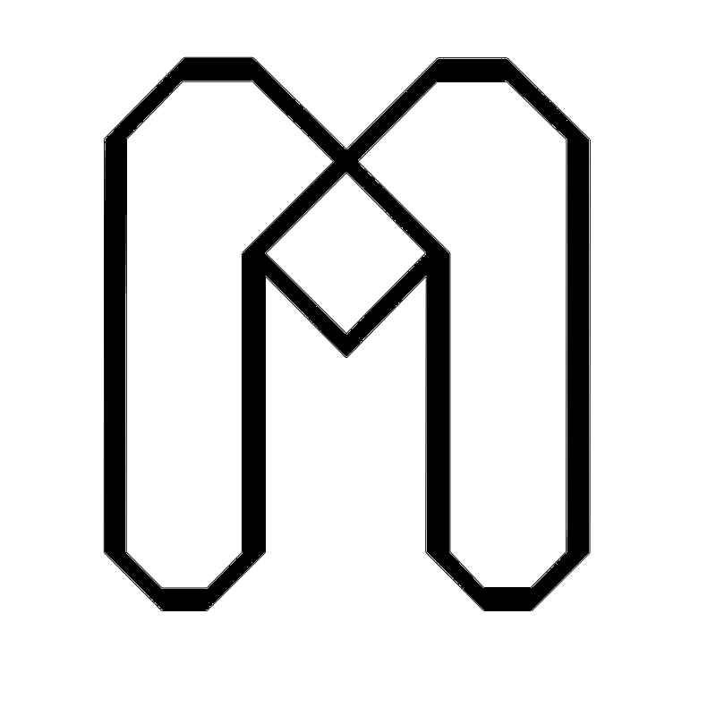

# 🚀 MEME-Finder Landing Page

<div align="center">



[](https://www.typescriptlang.org/)
[](https://reactjs.org/)
[](https://vitejs.dev/)
[](https://tailwindcss.com/)

[](https://python.org/)
[](https://aws.amazon.com/)
[](https://firebase.google.com/)
[](https://swift.org/)
[](https://developer.android.com/jetpack/compose)
[](https://kotlinlang.org/docs/multiplatform.html)

*The future of meme discovery is here* ✨

[🎯 Live Demo](https://memeai-assistant.github.io/landing-page) | [📖 Documentation](#) | [🤝 Contributing](#)

</div>

---

## 🎭 What is MEME-Finder?

**MEME-Finder: Multimodal Embedding-based Meme Exploration and Retrieval System** is an intelligent, context-aware meme retrieval system that revolutionizes digital communication for the new generation. Say goodbye to endless scrolling through meme folders! 🔍

### 💡 The Problem We Solve

> *"The perfect meme exists... somewhere"* 😤

Ever been in a conversation where you know the **perfect meme** exists but you can't find it? Or remember a meme visually but can't describe it? We've all been there! MEME-Finder bridges the gap between your thoughts and the perfect meme.

## ✨ Key Innovations

### 🧠 **Semantic Understanding**
- **Natural Language Queries**: Describe what you want, not what it's tagged as
- **Context-Aware Search**: Understands mood, emotion, and conversation flow
- **Memory-Based Discovery**: Find memes from vague visual memories

### 🔧 **Platform Flexibility**
- 📱 **Lightweight**: On-device inference for mobile apps
- ☁️ **Scalable**: Cloud-based architectures for precision
- 🔌 **Extensible**: Custom datasets and models

### 🎯 **Multimodal Intelligence**
- **Visual + Text**: Maps images and text into shared representation space
- **Adaptive Models**: Supports different AI models based on environment
- **Real-time Processing**: Instant results that keep conversations flowing

---

## 🚀 Major Usage Scenarios

### 💬 **Messaging & Social Platforms**
```
User: "I need something for when someone says something obvious"
MEME-Finder: 🎯 *Returns "No shit, Sherlock" memes instantly*
```

### 🧠 **Memory-Based Search**
```
User: "That suspicious guy in a car meme from a TV show"
MEME-Finder: 🔍 *Finds Doakes from Dexter memes*
```

### 📚 **Custom Collections**
- Build personalized meme libraries
- Context-aware sharing within teams
- Searchable private collections

### 🌐 **Community Integration**
- Seamless forum integration
- Enhanced group communication
- Cultural connection through shared humor

---


### 🌟 **Advanced Features**

- **🤖 Automatic Captioning**: AI-powered meme understanding
- **👤 Personalized Recommendations**: Learn user preferences (TBA)
- **📊 Context Re-ranking**: Conversation-aware results (TBA)
- **⚡ Real-time Processing**: Sub-second response times

---

## 🎨 Landing Page Features

This repository contains the stunning landing page for MEME-Assistant, built with modern web technologies:

### 🌐 **Frontend Stack**
- **⚡ Vite + React**: Lightning-fast development and production builds (yes, we really do use Vite! 😄)
- **🎨 TailwindCSS**: Beautiful, responsive design system  
- **📱 Mobile-First**: Optimized for all devices
- **🌟 Interactive Components**: Engaging user experience with GSAP animations
- **🎭 Team Showcase**: Meet the brilliant minds behind the magic

### 🔧 **Full MEME-Assistant Ecosystem**
- **🐍 Python**: AI/ML backend for semantic meme processing
- **☁️ AWS**: Scalable cloud infrastructure and deployment
- **🔥 Firebase**: Real-time database and user authentication
- **📱 Swift**: Native iOS app development  
- **🤖 Jetpack Compose**: Modern Android UI toolkit
- **🌍 Kotlin Multiplatform**: Cross-platform mobile development

---

## 🚀 Quick Start

```bash
# Clone the repository
git clone https://github.com/MemeAI-Assistant/landing-page.git

# Navigate to project directory
cd landing-page

# Install dependencies
npm install

# Start development server
npm run dev

# Build for production
npm run build
```

---

## 🎯 Why MEME-Finder Matters

> **"In a world where conversations move at the speed of thought, memes are the universal language of emotion and humor."**

MEME-Finder ensures that:
- 💨 **Conversations never lose momentum**
- 🎭 **Humor flows naturally**
- 🌍 **Communities stay connected**
- 🚀 **Digital communication evolves**

---

## 👥 Contributors

Meet the brilliant minds behind MEME-Assistant! 🧠✨

<div align="center">

<table>
<tr>
<td align="center">
<br/>
<b>Adilhan</b><br/>
🚀 <i>Core Developer</i>
</td>
<td align="center">
<br/>
<b>Ahmet</b><br/>
🎨 <i>Frontend Specialist</i>
</td>
<td align="center">
<br/>
<b>Alperen</b><br/>
🤖 <i>AI/ML Engineer</i>
</td>
</tr>
<tr>
<td align="center">
<br/>
<b>Eray</b><br/>
☁️ <i>Backend Developer</i>
</td>
<td align="center">
<br/>
<b>Mithat</b><br/>
📱 <i>Mobile Developer</i>
</td>
<td align="center">
<br/>
<b>You?</b><br/>
💫 <i><a href="#contributing">Join the team!</a></i>
</td>
</tr>
</table>

</div>

### 🤝 Contributing

We welcome contributions from the community! Whether you're interested in:

- 🐛 **Bug fixes** and improvements
- ✨ **New features** and enhancements  
- 📚 **Documentation** updates
- 🎨 **UI/UX** improvements
- 🧪 **Testing** and quality assurance

Check out our [Contributing Guidelines](#) to get started!

---

<div align="center">

## 🌟 Join the Meme Revolution!

**Ready to transform how the world communicates?**

[🚀 Get Started](https://memeai-assistant.github.io/landing-page)

---

*Made with ❤️ by the MEME-Finder Team*

**"Because the perfect meme should never be more than a thought away"** ✨

</div>